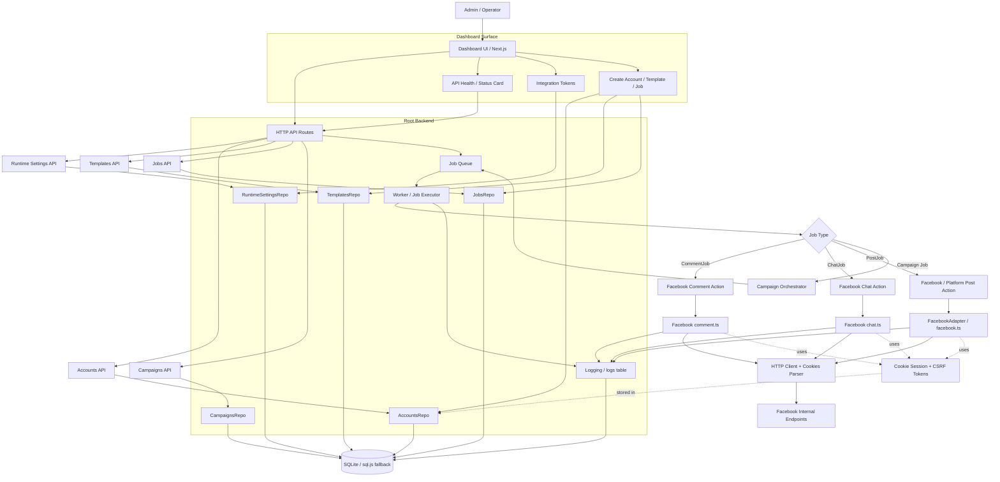

# Detailed Project Diagram

## Diagram Notes

- `Dashboard UI` is the user-facing surface in `dashboard/`.
- `HTTP API Routes` create and manage settings, accounts, templates, campaigns, and jobs.
- `RuntimeSettingsRepo` stores runtime/integration tokens such as WhatsApp, Telegram, Threads, Twitter, and Instagram.
- `AccountsRepo` stores encrypted account credentials, including Facebook cookie-based accounts.
- `Job Queue` hands work to the `Worker / Job Executor`.
- The worker selects the correct action based on job type: `CommentJob`, `ChatJob`, `PostJob`, or campaign-related jobs.
- Facebook actions use the existing cookie-based helpers and adapters in `src/adapters/providers/meta/facebook/`.
- All execution results are written to the `logs` table and persisted in SQLite.

## Execution Flow

1. Operator uses the dashboard to save settings, create accounts, create templates, and enqueue jobs.
2. API routes persist data through repository classes.
3. The queue receives a job and the worker picks it up.
4. The worker loads encrypted credentials, resolves the adapter or helper, and executes the action.
5. The adapter fetches tokens from Facebook, sends the request, and returns success or failure.
6. The worker writes logs and updates job/campaign status in the database.
